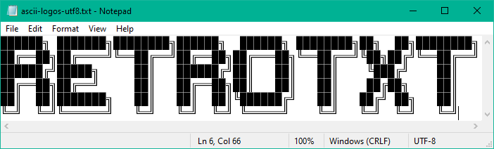
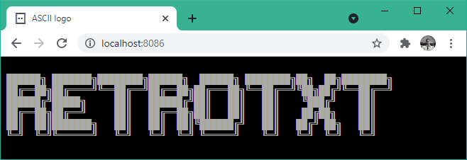

# RetroTxtGo

### [RetroTxt](https://github.com/bengarrett/retrotxt) for the terminal.

###### version α, a work-in-progress with an incomplete feature set.

## Quick Usage

#### Text art and files created without Unicode often fail to display on modern systems.

```sh
type ascii-logo.txt # or, cat ascii-logo.txt

�����ۻ ������ۻ�������ۻ�����ۻ  �����ۻ �������ۻ�ۻ  �ۻ�������ۻ
������ۻ������ͼ�������ͼ������ۻ�������ۻ�������ͼ��ۻ��ɼ�������ͼ
������ɼ����ۻ     �ۺ   ������ɼ�ۺ   �ۺ   �ۺ    ����ɼ    �ۺ
������ۻ����ͼ     �ۺ   ������ۻ�ۺ   �ۺ   �ۺ    ����ۻ    �ۺ
�ۺ  �ۺ������ۻ   �ۺ   �ۺ  �ۺ�������ɼ   �ۺ   ��ɼ �ۻ   �ۺ
�ͼ  �ͼ������ͼ   �ͼ   �ͼ  �ͼ �����ͼ    �ͼ   �ͼ  �ͼ   �ͼ
```

#### Use RetroTxtGo to print legacy text on modern terminals.

```sh
retrotxt view ascii-logo.txt

██████╗ ███████╗████████╗██████╗  ██████╗ ████████╗██╗  ██╗████████╗
██╔══██╗██╔════╝╚══██╔══╝██╔══██╗██╔═══██╗╚══██╔══╝╚██╗██╔╝╚══██╔══╝
██████╔╝█████╗     ██║   ██████╔╝██║   ██║   ██║    ╚███╔╝    ██║
██╔══██╗██╔══╝     ██║   ██╔══██╗██║   ██║   ██║    ██╔██╗    ██║
██║  ██║███████╗   ██║   ██║  ██║╚██████╔╝   ██║   ██╔╝ ██╗   ██║
╚═╝  ╚═╝╚══════╝   ╚═╝   ╚═╝  ╚═╝ ╚═════╝    ╚═╝   ╚═╝  ╚═╝   ╚═╝
```

#### Or save it to a Unicode file and view it in contemporary software.

```sh
retrotxt view ascii-logo.txt > ascii-logo-utf8.txt
```



#### Also turn the legacy text into a static website with accurate fonts and colors.

```sh
retrotxt create ascii-logo.txt --layout=compact
```

```html
<!DOCTYPE html>

<html lang="en">
  <head>
    <meta charset="utf-8" />
    <title>RetroTxtGo</title>
    <link rel="stylesheet" href="styles.css" />
    <link rel="stylesheet" href="font.css" />
  </head>

  <body>
    <main>
      <pre>
██████╗ ███████╗████████╗██████╗  ██████╗ ████████╗██╗  ██╗████████╗
██╔══██╗██╔════╝╚══██╔══╝██╔══██╗██╔═══██╗╚══██╔══╝╚██╗██╔╝╚══██╔══╝
██████╔╝█████╗     ██║   ██████╔╝██║   ██║   ██║    ╚███╔╝    ██║
██╔══██╗██╔══╝     ██║   ██╔══██╗██║   ██║   ██║    ██╔██╗    ██║
██║  ██║███████╗   ██║   ██║  ██║╚██████╔╝   ██║   ██╔╝ ██╗   ██║
╚═╝  ╚═╝╚══════╝   ╚═╝   ╚═╝  ╚═╝ ╚═════╝    ╚═╝   ╚═╝  ╚═╝   ╚═╝</pre>
    </main>
  </body>
</html>
```

#### Easily test and serve it over a HTTP server.

```sh
retrotxt create ascii-logo.txt -p0 --title="ASCII logo"

Web server is available at http://localhost:8086
Press Ctrl+C to stop
```



#### Save the files as a ready to use webpage.

```sh
retrotxt create ascii-logo.txt --save

saving to styles.css
saving to index.html
saving to ibm-vga8.woff2
saving to font.css
...
```

#### Or inline all the website assets into a single HTML file for easier sharing.

```sh
retrotxt create ascii-logo.txt --layout=inline --font-embed --title="ASCII logo"
```

```html
<!DOCTYPE html>

<html lang="en">
  <head>
    <meta charset="utf-8" />
    <title>ASCII logo</title>
    <style type="text/css">
      body{background-color:#000;display:flex;flex-dir...}
      @font-face{font-family:vga;src:url(data:application/font-woff2;charset=utf-8;base64,d09GMgA...)}
    </style>
  </head>

  <body>
    <main>
      <pre>
██████╗ ███████╗████████╗██████╗  ██████╗ ████████╗██╗  ██╗████████╗
██╔══██╗██╔════╝╚══██╔══╝██╔══██╗██╔═══██╗╚══██╔══╝╚██╗██╔╝╚══██╔══╝
██████╔╝█████╗     ██║   ██████╔╝██║   ██║   ██║    ╚███╔╝    ██║
██╔══██╗██╔══╝     ██║   ██╔══██╗██║   ██║   ██║    ██╔██╗    ██║
██║  ██║███████╗   ██║   ██║  ██║╚██████╔╝   ██║   ██╔╝ ██╗   ██║
╚═╝  ╚═╝╚══════╝   ╚═╝   ╚═╝  ╚═╝ ╚═════╝    ╚═╝   ╚═╝  ╚═╝   ╚═╝</pre>
    </main>
  </body>
</html>
```

---

## Features

- Convert ASCII text to HTML.
- [ ] Convert ANSI text to HTML.
- [ ] Convert BBS text to HTML.
- List or export (JSON, text, XML) meta details of a text file.
- List or export SAUCE metadata of a file.
- Transform the encoding of a text file. CP437 -> UTF8, UTF8 -> ISO8859-1 ...
- View any legacy encoded text file in a UTF8 terminal by converting on the fly.
- Extensive customizations through command flags or a configuration file with a setup.
- ANSI compatibility tests, output 16, 88, 256, high and true-color tables.
- Multi-platform support including Windows, macOS, Linux, Raspberry Pi and FreeBSD.
- IO redirection with piping support.

---

## Install

There are [downloads](https://github.com/bengarrett/retrotxtgo/releases/latest/) available for
[Windows](https://github.com/bengarrett/retrotxtgo/releases/latest/download/retrotxt_Windows_Intel.zip),
[macOS Intel](https://github.com/bengarrett/retrotxtgo/releases/latest/download/retrotxt_macOS_Intel.tar.gz),
[macOS M chips](https://github.com/bengarrett/retrotxtgo/releases/latest/download/retrotxt_macOS_M-series.tar.gz),
[Linux](https://github.com/bengarrett/retrotxtgo/releases/latest/download/retrotxt_Linux_Intel.tar.gz),
[FreeBSD](https://github.com/bengarrett/retrotxtgo/releases/latest/download/retrotxt_FreeBSD_Intel.tar.gz) and the
[Raspberry Pi](https://github.com/bengarrett/retrotxtgo/releases/latest/download/retrotxt_Linux_arm32_.tar.gz).

Otherwise these package manager installations are available.

#### Windows [Scoop](https://scoop.sh/)

```ps
scoop bucket add retrotxt https://github.com/bengarrett/retrotxtgo.git
scoop install bengarrett/retrotxt
retrotxt -v
```

#### macOS [Homebrew](https://brew.sh/)

```sh
brew cask install bengarrett/tap/retrotxt
retrotxt -v
```
#### DEB (Debian package)

```sh
# Intel
wget https://github.com/bengarrett/retrotxtgo/releases/latest/download/retrotxt_linux.deb
dpkg -i retrotxt.deb
retrotxt -v
```

```sh
# Raspberry Pi & ARM
wget https://github.com/bengarrett/retrotxtgo/releases/latest/download/retrotxt_raspberry_pi.deb
dpkg -i retrotxt_raspberry_pi.deb
retrotxt -v
```


#### RPM (Redhat package)

```sh
wget https://github.com/bengarrett/retrotxtgo/releases/latest/download/retrotxt_linux.rpm
rpm -i retrotxt.rpm
retrotxt -v
```

#### APK (Alpine package)
```sh
wget https://github.com/bengarrett/myip/releases/latest/download/retrotxt.apk
apk add retrotxt.apk
retrotxt -v
```

### Even More Uses

#### Print legacy codepage tables in the terminal.

```
retrotext list table cp437 latin1

 ―――――――――――――――――――――――――――――――――――――――――――――――――――――――――――――――――――
         IBM Code Page 437 (DOS, OEM-US) - Extended ASCII
     0   1   2   3   4   5   6   7   8   9   A   B   C   D   E   F
 0 |   | ☺ | ☻ | ♥ | ♦ | ♣ | ♠ | • | ◘ | ○ | ◙ | ♂ | ♀ | ♪ | ♫ | ☼ |
 1 | ► | ◄ | ↕ | ‼ | ¶ | § | ▬ | ↨ | ↑ | ↓ | → | ← | ∟ | ↔ | ▲ | ▼ |
 2 |   | ! | " | # | $ | % | & | ' | ( | ) | * | + | , | - | . | / |
 3 | 0 | 1 | 2 | 3 | 4 | 5 | 6 | 7 | 8 | 9 | : | ; | < | = | > | ? |
 4 | @ | A | B | C | D | E | F | G | H | I | J | K | L | M | N | O |
 5 | P | Q | R | S | T | U | V | W | X | Y | Z | [ | \ | ] | ^ | _ |
 6 | ` | a | b | c | d | e | f | g | h | i | j | k | l | m | n | o |
 7 | p | q | r | s | t | u | v | w | x | y | z | { | | | } | ~ | ⌂ |
 8 | Ç | ü | é | â | ä | à | å | ç | ê | ë | è | ï | î | ì | Ä | Å |
 9 | É | æ | Æ | ô | ö | ò | û | ù |   | Ö | Ü | ¢ | £ | ¥ | ₧ | ƒ |
 A | á | í | ó | ú | ñ | Ñ | ª | º | ¿ | ⌐ | ¬ | ½ | ¼ | ¡ | « | » |
 B | ░ | ▒ | ▓ | │ | ┤ | ╡ | ╢ | ╖ | ╕ | ╣ | ║ | ╗ | ╝ | ╜ | ╛ | ┐ |
 C | └ | ┴ | ┬ | ├ | ─ | ┼ | ╞ | ╟ | ╚ | ╔ | ╩ | ╦ | ╠ | ═ | ╬ | ╧ |
 D | ╨ | ╤ | ╥ | ╙ | ╘ | ╒ | ╓ | ╫ | ╪ | ┘ | ┌ | █ | ▄ | ▌ | ▐ | ▀ |
 E | α | ß | Γ | π | Σ | σ | µ | τ | Φ | Θ | Ω | δ | ∞ | φ | ε | ∩ |
 F | ≡ | ± | ≥ | ≤ | ⌠ | ⌡ | ÷ | ≈ | ° | ∙ | · | √ | ⁿ | ² | ■ |   |

 ―――――――――――――――――――――――――――――――――――――――――――――――――――――――――――――――――――
          ISO 8859-1 (Western European) - Extended ASCII
     0   1   2   3   4   5   6   7   8   9   A   B   C   D   E   F
 0 |   |   |   |   |   |   |   |   |   |   |   |   |   |   |   |   |
 1 |   |   |   |   |   |   |   |   |   |   |   |   |   |   |   |   |
 2 |   | ! | " | # | $ | % | & | ' | ( | ) | * | + | , | - | . | / |
 3 | 0 | 1 | 2 | 3 | 4 | 5 | 6 | 7 | 8 | 9 | : | ; | < | = | > | ? |
 4 | @ | A | B | C | D | E | F | G | H | I | J | K | L | M | N | O |
 5 | P | Q | R | S | T | U | V | W | X | Y | Z | [ | \ | ] | ^ | _ |
 6 | ` | a | b | c | d | e | f | g | h | i | j | k | l | m | n | o |
 7 | p | q | r | s | t | u | v | w | x | y | z | { | | | } | ~ |   |
 8 |   |   |   |   |   |   |   |   |   |   |   |   |   |   |   |   |
 9 |   |   |   |   |   |   |   |   |   |   |   |   |   |   |   |   |
 A |   | ¡ | ¢ | £ | ¤ | ¥ | ¦ | § | ¨ | © | ª | « | ¬ | ­  | ® | ¯ |
 B | ° | ± | ² | ³ | ´ | µ | ¶ | · | ¸ | ¹ | º | » | ¼ | ½ | ¾ | ¿ |
 C | À | Á | Â | Ã | Ä | Å | Æ | Ç | È | É | Ê | Ë | Ì | Í | Î | Ï |
 D | Ð | Ñ | Ò | Ó | Ô | Õ | Ö | × | Ø | Ù | Ú | Û | Ü | Ý | Þ | ß |
 E | à | á | â | ã | ä | å | æ | ç | è | é | ê | ë | ì | í | î | ï |
 F | ð | ñ | ò | ó | ô | õ | ö | ÷ | ø | ù | ú | û | ü | ý | þ | ÿ |
```

### Building RetroTxtGo for other systems

[Go](https://golang.org/doc/install) supports [dozens of architectures and operating systems](https://golang.org/doc/install/source#environment).

Note: The version string returned by `retrotxt -v` will always be `x0.0.0` for user builds.

#### Working on Windows, PowerShell

```powershell
# clone and access repo
git clone https://github.com/bengarrett/retrotxtgo.git; cd retrotxtgo

# build retrotxt for the host system
go test ./...
go build -o retrotxt.exe
.\retrotxt.exe -v

# to see a list of supported platforms
go tool dist list

# to build retrotxt for windows/386, 32-bit Windows 7 and later
$Env:GOOS="windows"; $Env:GOARCH="386"; go build -o retrotxt.exe; .\retrotxt.exe -v

# be sure to remove or revert these two temporary environment vars
$Env:GOOS=""; $Env:GOARCH="";
```

#### Working with other shells and platforms
```bash
# clone and access repo
git clone https://github.com/bengarrett/retrotxtgo.git && cd retrotxtgo

# build retrotxt for the host system
go test ./...
go build -o retrotxt
./retrotxt -v

# to see a list of supported platforms
go tool dist list

# build retrotxt for linux/386, 32-bit Linux
env GOOS=linux GOARCH=386 && go build -o retrotxt && ./retrotxt -v
```

---

### Why create RetroTxt using Go?

- Native [Unicode](https://golang.org/pkg/unicode/), UTF 8/16/32 support.
- [A large selection of native legacy text encodings](golang.org/x/text/encoding/charmap).
- Builds a standalone binary with no dependencies.
- [Wide operating system and CPU architecture support](https://gist.github.com/asukakenji/f15ba7e588ac42795f421b48b8aede63).
- Uses a simple, compact standard library with extremely fast compiling.
- The standard library has helpful and safe web templating such as HTML, JSON, XML.
- It is a language I know. 😉
